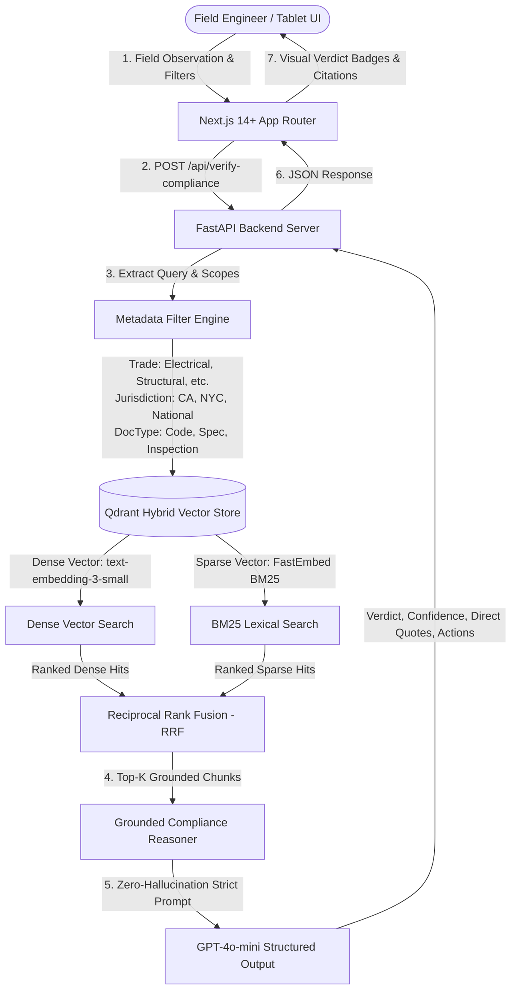

# SiteShield AI — On-Site Construction Compliance Verification Assistant

A full-stack, hybrid RAG prototype designed for on-site construction and field quality assurance engineers. It enables instant, strictly-grounded compliance cross-referencing against statutory Building Codes (IBC, NEC, UPC, California CBC Title 24, NYC Codes), Project Specifications (CSI MasterFormat Divisions 03, 21, 22, 26), and Historical Field Inspection Logs.

---

## 🏗️ Architectural Overview



---

## ✨ Key Features

1. **Hybrid Retrieval (Dense + BM25 Sparse Vector)**: Combines semantic concept matching with exact technical code reference precision (e.g. `300.22(C)`, `4,500 psi`, `ASTM E814`) via Qdrant and FastEmbed BM25.
2. **Multi-Tenant Scoped Filtering**: Dynamic payload filtering by:
   - **Trade**: *Electrical, Fire Safety, Structural, Plumbing*
   - **Jurisdiction**: *National (Model Codes), California (CBC Title 24), NYC (NYC Codes)*
   - **Document Type**: *Statutory Building Code, Project Spec, Inspection Log / NCR*
3. **Strict Zero-Hallucination Grounding**:
   - Every compliance assertion is accompanied by exact clause citations and verbatim excerpts.
   - If the retrieved context lacks governing rules, it explicitly issues an `Ambiguous/Insufficient Data` verdict and specifies missing submittals.
4. **Interactive Industrial UI**:
   - High-contrast titanium/slate aesthetic built with Tailwind CSS and Lucide React.
   - Real-time Verdict Badges (**Compliant**, **Non-Compliant**, **Ambiguous**).
   - Expandable Citation Explorer with verbatim quote copying.
   - Raw Evidence Inspector for vector search transparency.
   - One-click field scenario presets.
   - One-click export of formatted markdown field reports for site logs.

---

## 🚀 Quickstart Guide

### Prerequisites
- **Python 3.10+** (Tested on Python 3.11)
- **Node.js 18+** & `npm`
- (Optional) **OpenAI API Key** (A built-in expert rule engine provides offline fallback if no API key is supplied)

---

### Step 1: Set Up Backend (`backend/`)

1. Open a terminal and navigate to the backend folder:
   ```bash
   cd backend
   ```

2. Create and activate a Python virtual environment:
   ```bash
   # Windows PowerShell
   python -m venv venv
   .\venv\Scripts\Activate.ps1

   # Linux / macOS
   python3 -m venv venv
   source venv/bin/activate
   ```

3. Install required Python packages:
   ```bash
   pip install -r requirements.txt
   ```

4. Configure your environment:
   ```bash
   # Copy sample environment configuration
   cp .env.example .env
   ```
   *(Optional: Edit `.env` and set your `OPENAI_API_KEY=sk-...`)*

5. (Optional) Run the standalone ingestion script:
   ```bash
   python ingest.py
   ```

6. Start the FastAPI backend server:
   ```bash
   python -m uvicorn main:app --host 127.0.0.1 --port 8000 --reload
   ```
   *The backend will be available at `http://127.0.0.1:8000` (Swagger UI at `http://127.0.0.1:8000/docs`).*

---

### Step 2: Set Up Frontend (`frontend/`)

1. In a new terminal window, navigate to the frontend folder:
   ```bash
   cd frontend
   ```

2. Install Node.js dependencies:
   ```bash
   npm install
   ```

3. Start the Next.js development server:
   ```bash
   npm run dev
   ```
   *The frontend will be running at `http://localhost:3000`.*

---

## 🧪 Interactive Preset Test Scenarios

| Scenario | Query Summary | Scope Filters | Expected Verdict | Governing Citation |
|---|---|---|---|---|
| **⚡ Plenum PVC** | "Can we run Schedule 40 PVC conduit in ceiling plenum?" | Electrical / National / Code | ❌ **Non-Compliant** | NEC Article 300.22(C) |
| **🏢 Concrete PSI** | "Cylinder break test achieved 4,850 psi for PT slab" | Structural / National / Spec | ✅ **Compliant** | Spec Div 03 30 00 §2.03.A |
| **🔥 Firestop Seal** | "Annular space packed with bare ceramic wool only" | Fire Safety / National / Code | ❌ **Non-Compliant** | IBC Section 714.4.1.2 |
| **💧 DWV Water Test** | "30-min hydrostatic test with 42-ft static head" | Plumbing / National / Code | ✅ **Compliant** | UPC Section 312.2 |
| **📐 Egress Width** | "Stairway serving 120 occupants has 40-inch width" | Structural / National / Code | ❌ **Non-Compliant** | IBC Section 1011.2 (Min 44 in) |
| **❓ Ambiguous Query** | "Acoustic wrap thickness for office panels" | All / All / All | ⚠️ **Ambiguous** | Missing Project Submittals |

---

## 📁 Repository Structure

```
.
├── backend/
│   ├── .env.example          # Environment variable template
│   ├── ingest.py             # Qdrant Hybrid collection setup & chunk ingestion
│   ├── main.py               # FastAPI server with CORS and /api/verify-compliance
│   ├── mock_data.py          # Realistic statutory codes (IBC, NEC, UPC, CBC) & specs
│   ├── requirements.txt      # Python dependencies (FastAPI, Qdrant, FastEmbed, LangChain)
│   └── schemas.py            # Pydantic models for queries, citations, and responses
├── frontend/
│   ├── app/
│   │   ├── globals.css       # Custom industrial styling & glassmorphism
│   │   ├── layout.js         # Root layout with Inter / JetBrains Mono fonts
│   │   └── page.js           # Client component with verification UI & citations
│   ├── package.json          # Next.js 14, React 18, Tailwind CSS, Lucide icons
│   ├── postcss.config.js     # PostCSS configuration
│   └── tailwind.config.js    # Tailwind configuration & custom palette tokens
├── implementation_plan.md    # Initial technical specification
└── README.md                 # Complete documentation & usage guide
```
